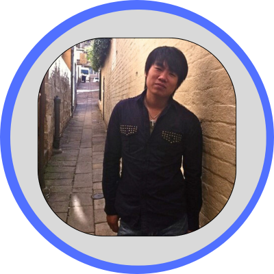

# ClickStack in Action: Building Real-Time Observability for Developers
## Clickhouse Workshop facilitated by Johnny Mirza, Jeremy Chen

### Meet the Instructors

* { width="200" } Johnny Mirza
* { width="200" } Jeremy Chen

### Abstract
Real-time visibility is a game-changer for developers building and running modern applications. In this hands-on session, participants will deploy a complete observability stack using ClickHouse, OpenTelemetry, and HyperDX. You’ll ingest and correlate logs, metrics, and application data, and explore powerful querying techniques through both SQL and Lucene-based syntax in the UI.

Through a mix of instructor-led training and hands-on labs, you’ll learn to:
* Deploy and connect ClickHouse, OpenTelemetry Collector, and HyperDX
* Ingest logs, metrics, and custom application events
* Correlate multi-source telemetry for deeper observability
* Navigate the HyperDX UI for querying and analysis
* Use SQL and Lucene syntax for structured and unstructured event search

By the end of this workshop, you’ll be equipped to combine ClickHouse’s real-time analytics with HyperDX’s observability to accelerate debugging, optimize performance, and build more reliable applications.

### Who should attend
DevOps, SREs, and backend engineers

### Pre-requisites
None. Familiarity with terminals and containers is helpful.
