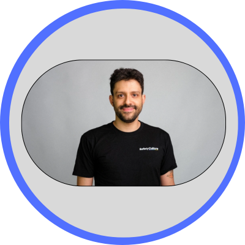

# { width="200" }Miguel Elias dos Santos - SafetyCulture

## Platform Engineering IS Software Engineering
### Abstract
Many engineering teams still view their internal platforms as a cost center - a necessary layer of Infrastructure managed by a siloed Ops team. Let's defy that.

This talk will demonstrate that effective Platform Engineering is fundamentally a Software Engineering discipline. We will explore how to shift your team's mindset to treat your Internal Development Platform as a living Product, with your developers as the primary customers.

Let's borrow the best practices from Software Engineering and apply them directly to our Platform design.

Attendees will leave with a clear roadmap for transforming their platform efforts. This session moves beyond theory, providing practical techniques to enhance developer autonomy and accelerate the path from code to production. We will connect these engineering improvements directly to tangible Business value, showing how a superior developer experience becomes a powerful engine for innovation and a key competitive differentiator for your entire organisation.

Key points:

- `Platform as a Product`: Applying product management lifecycles—from roadmaps to user feedback—to your internal platform.

- `Measuring What Matters`: Defining and tracking Developer Experience (DevEx) as a first-class metric to guide your efforts.

- `Designing ""Golden Paths""`: Building paved roads that make it easy for developers to ship performant and reliable software in a secure way.

- `""Drinking Your Own Champagne""`: Applying rigorous CI/CD, testing, and observability to the platform itself.

- `Communicating Upwards`: How to articulate the ROI of Platform improvements and tie your work directly to business objectives.

### Speaker Bio
With a Software Engineering background of 15 years of which 11 years focus on Platform Engineering, I have an interesting mixture of programming and infrastructure knowledge that allows me to tackle complex challenges in the cloud infrastructure space without the restriction of just being able to install and operate off-the-shelf tooling.

Interesting facts:
- My current team sometimes calls me "MiGo" which is a fun twist over [Miguel](https://www.linkedin.com/in/miguel-elias-dos-santos/){target=_blank} + Go (the programming language) as I keep saying Golang is the answer for things

- I'm colourblind for some color mixtures (specially pink, maroon, brown mixes)