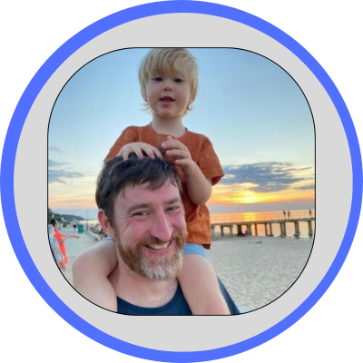

# { width="200" } Sam Dwyer - Nine

## Building an observability platform for the future

### Abstract
Observability has rapidly become the most critical, yet often misunderstood, challenge in modern software development. For too long, the promise of "easy" vendor solutions has inadvertently created a dependency on auto-instrumentation, stifling genuine innovation and leaving teams drowning in data without clear answers. We've all felt the pain: ""We pay so much for observability, but it doesn't feel like we're getting much value."

This session is for anyone struggling to get real value from their current observability tools, curious about the potential of OpenTelemetry, or looking to move beyond simple monitoring to truly understand and proactively manage their complex distributed systems.
