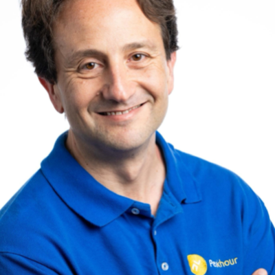
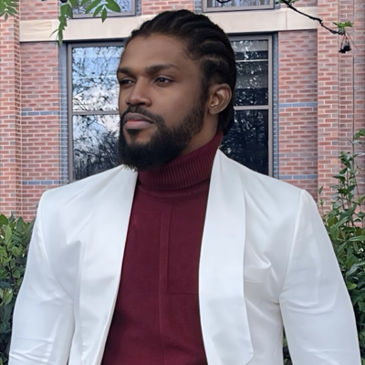
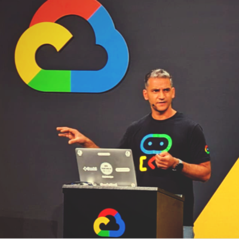
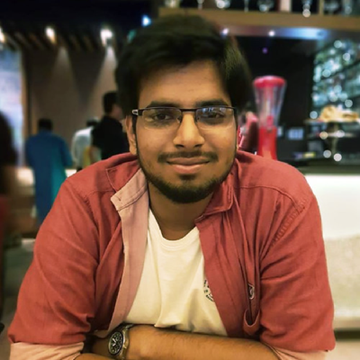
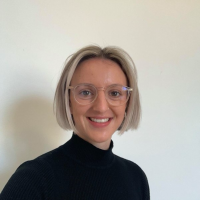
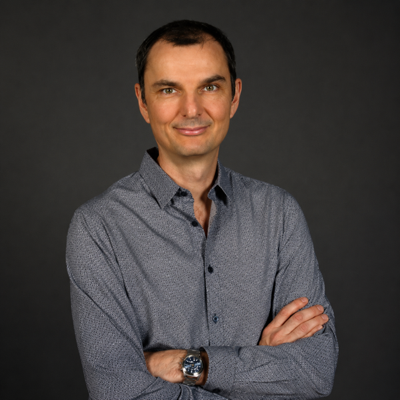
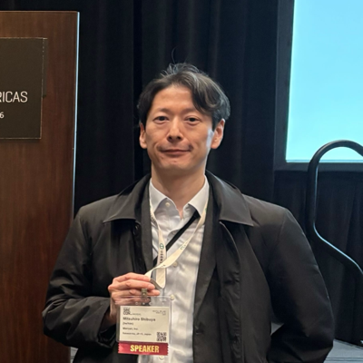
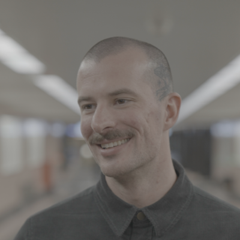

---
hide:
  - toc
  - navigation
---

## Topics and Types

CloudCon will have sessions on the following areas:

* Kubernetes
* Artificial Intelligence (AI & ML)
* Platform Engineering
* Security
* Other

---

# Speakers

20 speakers confirmed for CloudCon Sydney 2026, 9-10 November at ICC Sydney.

- [ Adam Cassar](abstracts/2026/AdamCassarDanielDAlessandro.md)
- [ Alex Eze](abstracts/2026/AlexEze.md)
- [ Andrew Jeffree](abstracts/2026/AndrewJeffree.md)
- [ Anupam Phoghat](abstracts/2026/AnupamPhoghat.md)
- [ Ashan Senevirathne](abstracts/2026/AshanSenevirathne.md)
- [ Ayush Goyal](abstracts/2026/AyushGoyal.md)
- [ Charlotte Fleming](abstracts/2026/CharlotteFleming.md)
- [ Chris Porter](abstracts/2026/ChrisPorter.md)
- [ Daniel D'Alessandro](abstracts/2026/AdamCassarDanielDAlessandro.md)
- [ Hannah Olukoye](abstracts/2026/MofesolaBabalolaHannahOlukoye.md)
- [ Jacob Taylor](abstracts/2026/JacobTaylorVasiliosSyrakis.md)
- [ Liz Fong-Jones](abstracts/2026/LizFongJones.md)
- [ Michael Fornaro](abstracts/2026/MichaelFornaroSamiAlakus.md)
- [ Mitsuhiro Shibuya](abstracts/2026/MitsuhiroShibuya.md)
- [ Mofesola Babalola](abstracts/2026/MofesolaBabalolaHannahOlukoye.md)
- [ Olga Mirensky](abstracts/2026/OlgaMirensky.md)
- [ Osama Okunbo](abstracts/2026/OsamaOkunbo.md)
- [ Sami Alakus](abstracts/2026/MichaelFornaroSamiAlakus.md)
- [ Saurabh Mishra](abstracts/2026/SaurabhMishra.md)
- [ Vasilios Syrakis](abstracts/2026/JacobTaylorVasiliosSyrakis.md)

---

# Sessions

| Session | Speakers | Length |
|---|---|---|
| [Cloud Native Global Load Balancing with K8gb](abstracts/2026/ChrisPorter.md) | Chris Porter, Nutanix | 20 min |
| [Building a serverless airplane tracker](abstracts/2026/LizFongJones.md) | Liz Fong-Jones, Honeycomb.io | 20 min |
| [Who's Stealing My CPU? Catching Noisy Neighbours with eBPF on Kubernetes](abstracts/2026/OlgaMirensky.md) | Olga Mirensky, Ping Identity | 20 min |
| [When your circuit breaker backfires — outlier detection in Istio and Envoy](abstracts/2026/MitsuhiroShibuya.md) | Mitsuhiro Shibuya, Mercari | 20 min |
| [AI and platform maturity: the foundations that help AI deliver](abstracts/2026/CharlotteFleming.md) | Charlotte Fleming, Octopus Deploy | 5 min |
| [The Bot Might Be Your Customer - Rethinking Traffic Management](abstracts/2026/AdamCassarDanielDAlessandro.md) | Adam Cassar, Peakhour.io & Daniel D'Alessandro, Peakhour.io | 20 min |
| [I'm Behind Seven Proxies: Demystifying Envoy on Kubernetes](abstracts/2026/JacobTaylorVasiliosSyrakis.md) | Jacob Taylor, Canva & Vasilios Syrakis | 20 min |
| [Telstra's GitOps Journey: Scaling Reliable Mobile Core Operations with Kubernetes](abstracts/2026/AshanSenevirathne.md) | Ashan Senevirathne, Telstra | 20 min |
| [The Telemetry Trap: Building Meaningful Open-Source Observability for Multi-Agent Systems](abstracts/2026/AnupamPhoghat.md) | Anupam Phoghat, Core-X | 20 min |
| [Operators as Data: Why Lifecycle is Not a Separate Problem](abstracts/2026/AlexEze.md) | Alex Eze, NHS | 5 min |
| [Who Load-Tests the Load Tester? 25 Million VUs and Everything That Broke](abstracts/2026/AyushGoyal.md) | Ayush Goyal, Grafana Labs | 20 min |
| [The Day I Found Out My Policies Were Off](abstracts/2026/OsamaOkunbo.md) | Osama Okunbo, Immibuddy | 20 min |
| [Streaming Under Fire](abstracts/2026/MichaelFornaroSamiAlakus.md) | Michael Fornaro, Easygo & Sami Alakus, Easygo | 20 min |
| [The Service Mesh: Solving Microservice Chaos (And When You Actually Need One)](abstracts/2026/MofesolaBabalolaHannahOlukoye.md) | Mofesola Babalola, Tempo & Hannah Olukoye, mobile.de | 20 min |
| [Platform Patterns for AI on K8s: Admission, Isolation & Observability That Work](abstracts/2026/SaurabhMishra.md) | Saurabh Mishra, Vodafone | 20 min |
| [ArgoCD, 16,000 Apps, and a Trail of Questionable Decisions](abstracts/2026/AndrewJeffree.md) | Andrew Jeffree, SafetyCulture | 20 min |

---

Past speakers from CloudCon Sydney 2025 are listed on the [full speaker archive](full_speakers.md).
